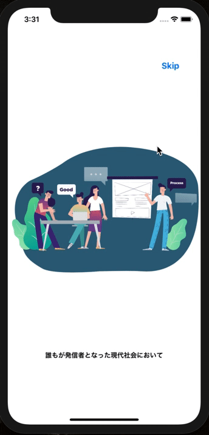

<h2 align="center">News App</h2>

  

# 概要
**世界の最新ニュースを閲覧できるスマートニュース風アプリ**です。世界の新聞・テレビ局（Yahoo！！・NHK・マカオ新聞・CNN・BBC・朝鮮日報）の最新ニュースを一つのアプリで簡単に見ることができます。

# 制作期間
3日間

# 制作背景(意図)
今日、アメリカの黒人殺害事件をはじめ、人種間・国家間などで差別や中傷、偏見が様々な問題を生み出しています。そうした中で、重要なのは一つの立場から発信された情報を鵜呑みにするのではなく、多様な意見に触れた上で自らの意見を持つことであると思います。普段私たちが触れるメディアの数には限りがあり、当然その情報は、物事の本質を一部しか捉えていません。そこで、国内外様々なメディアのニュースを簡単に見れることができれば、人々の情報リテラシーをあげることにつながると思いました。また、Swiftの新しい項目としてXML解析、Lottieの使い方、動画の再生、SegementSlideViewControllerを学習したいと思ったため、制作に至りました。
 
# DEMO
## 1 アニメーション付きのアプリの説明

  
  
  
  
  

## 2 ログイン

  

## 3 世界の最新のニュースを見る

  

# 工夫したポイント
- アプリ起動時にアプリのコンセプト＆説明を表示することで、ユーザーにアプリのイメージを付けてもらいました。
- 機能を限定的にすることで、ユーザーの操作性を高く保つように設計しました。

# 使用技術(開発環境)
Swift/Xcode/Github

# 課題や今後実装したい機能
<dl>
  <dt>相互評価（いいね）ができない</dt>
  <dd>DBを作成し、ユーザー同士が評価できるようにしたい</dd>
  <dt>初見の人は、このアプリの趣旨がわからない</dt>
  <dd>トップ画面でアプリの説明を挿入する</dd>
</dl>

